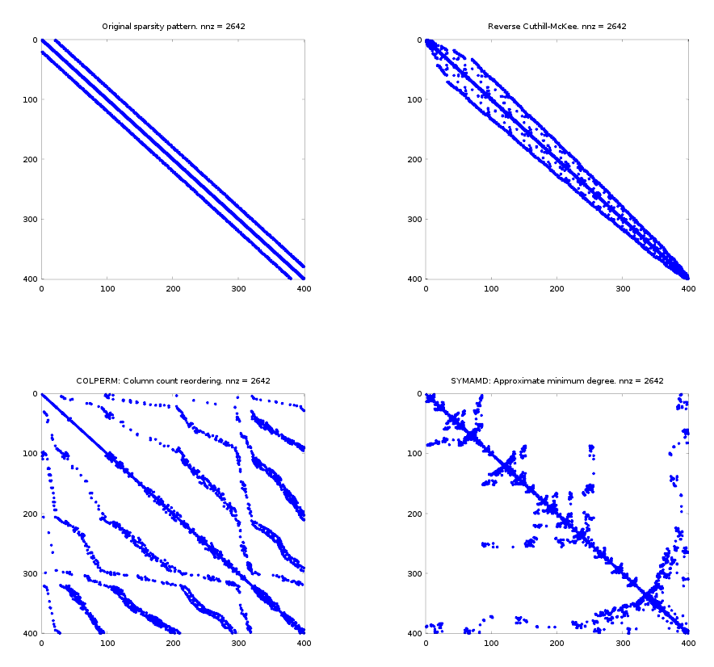
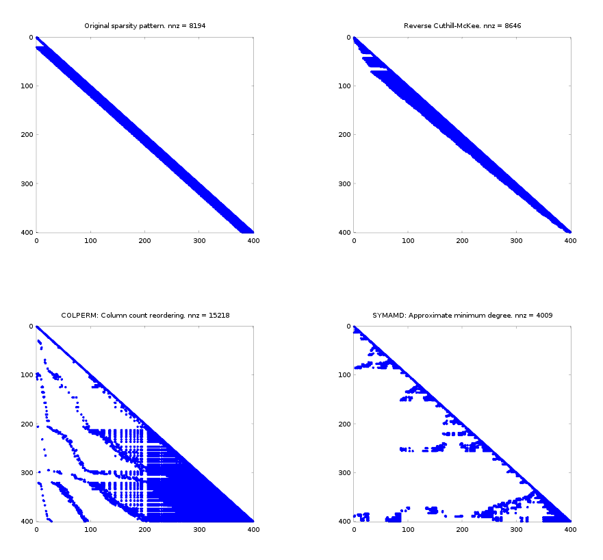

# Matlab Scripts

## Simple Mesh Generators
 - **gen_rectangle_mesh.m**: Generates a homogenous triangulation for a rectangular domain of size _Lx x Ly_. Type `help gen_rectangle_mesh` for details.

## Demos

### Sparsity Patterns and Ordering.

- **sparsity_pattern_demo.m**: visualizes the sparsity pattern of the mass matrix for a rectangular domain generated with `gen_rectangle_mesh.m`. The demo also comparse the sparsity pattern obtained by using different ordering of the mesh nodes.

- **factorized_sparsity_pattern_demo.m**: This demo uses a Cholesky factorization on the mass matrix from the previous demo _sparsity_pattern_demo.m_. The factorization is run on the same matrix with different ordering in order to compare the amount of filling required by the factorization. This can be seen in the figure below. Notice that the _approximate minimum degree_ algorithm results in the smallest number of non-zeros.

