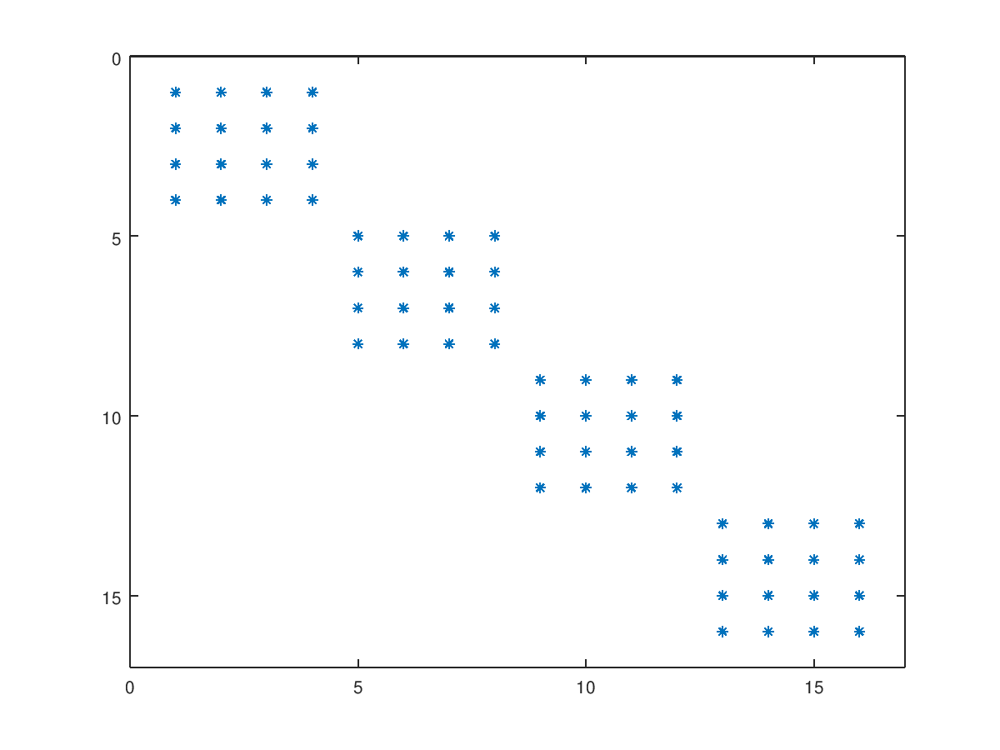
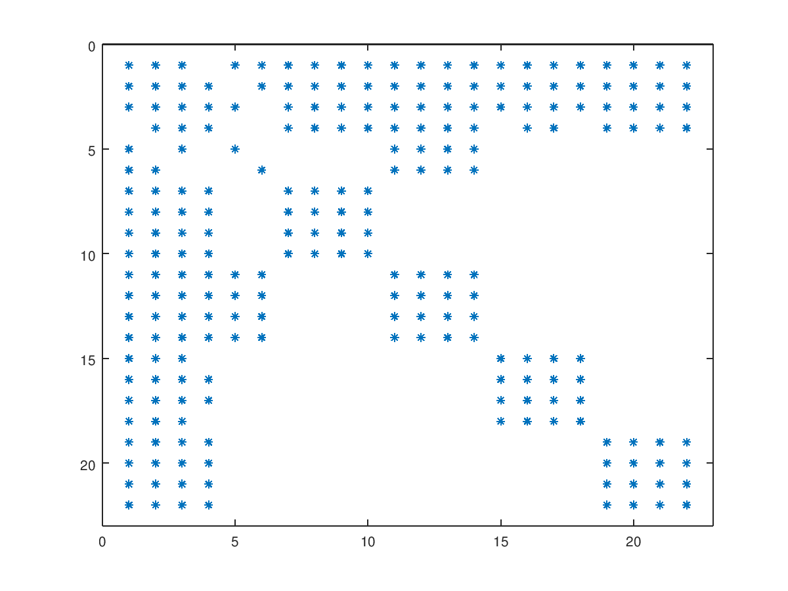

These benchmarks were put together baed on the Cassie benchmarks in
`examples/multibody/cassie_benchmark`. See README file for Cassie benchmarks in
case you need more details regarding the profiling tools. Here I'll summarize
the strictly needed instructions.

Running the Mass Matrix Benchmarks
----------------------------------

From Drake's root directory, run the benchmarks with:

    $ ./examples/multibody/mass_matrix_benchmarks/conduct_experiment ./my_bench

where `./my_bench` names a directory where results will be written. Directory
`my_bench` **must** not exist. If existent from a previous run, either rename or
delete.

**Note**: The first time this is run, the script will ask for SUDO privileges to
install tools for CPU speed control.

## Results

For the example above, look at results with `more my_bench/summary.txt`.

There are four cases benchmarked:
 1. Mass matrix computation.
 2. LTDL computation using Featherstone's algorithm.
 3. Eigen dense Cholesky LDLT factorization.
 3. Eigen sparse Cholesky LDLT factorization.

For each, the benchmark reports mean, median, standard deviation, minimum and
maximum cost (in nanoseconds). The benchmarks also count the number of
allocations.

Running Featherstone's LTDL Unit Tests
--------------------------------------

We compute the parent array λ(i) used in [Featherstone, 2005] to encode the mass
matrix's sparsity pattern. These tests use λ(i) to compute the LTDL
factorization of the mass matrix as described in [Featherstone, 2005]. We load
two models:
 1. Allegro hand welded to the world: 16 degrees of freedom (DOF) model. Each
    joint has one DOF.
 2. Free floating Allegro hand: The palm of the hand has a quaternion joint (6
    DOFs). This demonstrates the usage of the expanded λ(i) for multi-DOF
    joints.

**Note**: The LTDL algorithm oblivious to how λ(i) is obtained and to whether it
corresponds to models having multi-DOF joints or not. This unit test
demonstrates that.    

To run the test:

    $ bazel run examples/multibody/mass_matrix_benchmarks:featherstone_ltdl_test

Mass Matrix Sparsity
--------------------

| Sparisty Pattern for the Anchored Allegro Hand |
| :---: |
|     |
|  |

| Sparisty Pattern for the Floating Allegro Hand |
| :---: |
|     |
|  |

References
----------

[Featherstone, 2005] Efficient factorization of the joint-space inertia matrix
for branched kinematic trees. The International Journal of Robotics Research,
24(6), pp.487-500.

